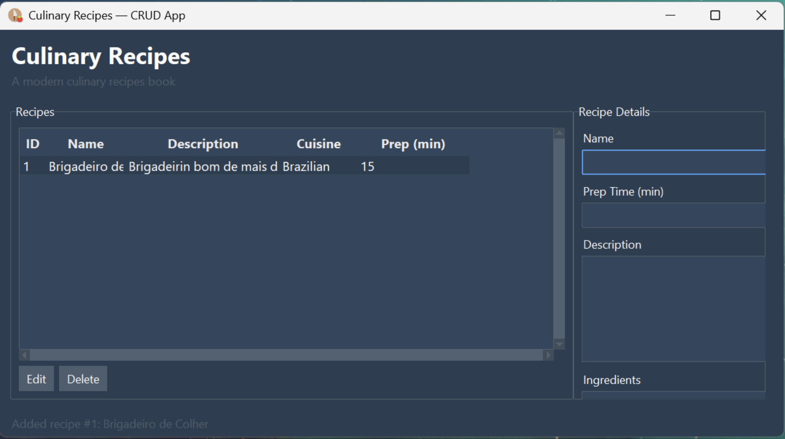

# Culinary Recipes CRUD

A user-friendly desktop application for managing your culinary recipes, built with Python and Tkinter. This project was developed for the System Development (`Desenvolvimento de Sistemas`) class at CEUB.



---

## About The Project

This application provides a simple and intuitive graphical interface for users to perform CRUD (Create, Read, Update, Delete) operations on a collection of culinary recipes. It serves as a practical demonstration of database integration with a desktop GUI.

### Features

- **Create Recipes:** Add new recipes with details like name, ingredients, and instructions.
- **View & Search:** Browse the list of all saved recipes.
- **Update Recipes:** Easily edit and save changes to existing recipes.
- **Delete Recipes:** Remove recipes you no longer need.
- **Modern Interface:** A clean and pleasant UI built with Ttkbootstrap.

### Future Features

- [ ] Advanced search and filtering (by ingredient, cuisine type, etc.).
- [ ] AI-powered assistant to create and suggest new recipes.
- [ ] Functionality to import/export recipes.

---

## Tech Stack

This project was built using the following technologies:

- **Python:** The core programming language.
- **Tkinter:** The standard Python library for creating graphical user interfaces.
- **Ttkbootstrap:** A theme extension for Tkinter that provides modern, professional-looking widgets.
- **SQLite:** A lightweight, serverless, self-contained SQL database engine used for local data storage.

---

## 🚀 Getting Started

To get a local copy up and running, follow these simple steps.

### Prerequisites

Make sure you have the following installed on your system:

- [Python 3.8+](https://www.python.org/downloads/)
- [Git](https://git-scm.com/downloads/)

### Installation

1.  **Clone the repository:**

    ```sh
    git clone https://github.com/BudaBecker/devsis-CEUB.git
    cd devsis-CEUB
    ```

2.  **Create and activate a virtual environment:** This isolates the project's dependencies from your system.

    - On **Windows**:
      ```sh
      python -m venv .venv
      .venv\Scripts\activate
      ```
    - On **macOS / Linux**:
      ```sh
      python3 -m venv .venv
      source .venv/bin/activate
      ```

3.  **Install the required dependencies:**
    ```sh
    pip install -r requirements.txt
    ```

### Running the Application

With the dependencies installed, run the main application module:

```sh
python -m app
```

---

## 👥 Authors

- **Gabriel Becker Cidral** - [BudaBecker](https://github.com/BudaBecker)
- **Guilherme Rocha de Barros** - [GuidaGaita](https://github.com/GuidaGaita)
